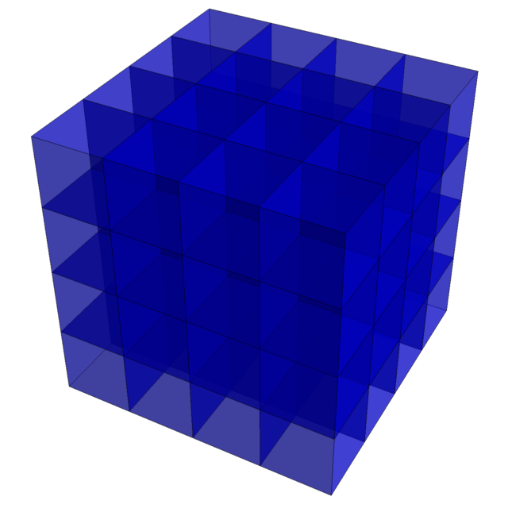

Cross-Platform Aligned Data Structures
======================================

`cpads` is Hatsya's open-source C++ header-only library providing various
utility functions and containers of aligned POD types. It requires a minimum
standard of C++11, but is also compatible with later standards. Compilation
has been tested on both GCC and Clang (LLVM).

Much of the code is written with performance in mind, so you want to use
compiler optimisation level `-O3` to make the best use of this.

The open-source cellular automata library [lifelib][6] is built on top of
`cpads`, as are many of Hatsya's internal projects.

include/cpads/core.hpp
----------------------

This includes various cross-platform intrinsics for CPU and GPU code.
In particular, we expose functions with the following names:

    hh::(rotl|rotr|popc|ffs|clz|ctz)(32|64)

which work in both `__host__` and `__device__` code, wrapping either
the compiler builtins or the CUDA intrinsics. We also include a couple
of transcendental functions for `uint64_t` values:

    uint64_t hh::constexpr_log2(uint64_t x)
    uint64_t hh::floor_sqrt(uint64_t x)

which compute $`\lfloor \log_2(x) \rfloor`$ and $`\lfloor \sqrt{x} \rfloor`$
respectively. Moreover, `hh::constexpr_log2` is usable in compile-time code.

There are also some basic integer hashing functions in here which are used
by the higher-level data structures.

include/cpads/memory.hpp
------------------------

This exposes the function `void* hh::zalloc(uint64_t nbytes)` which
zero-allocates a block of a given number of bytes, aligned so that the
pointer is a multiple of 128 bytes. Unlike `posix_memalign`, this is
cross-platform and is guaranteed to zero out the returned memory.

To deallocate a pointer allocated by `hh::zalloc`, we provide `hh::zfree`.

include/cpads/ivector.hpp
-------------------------

This exposes a class `hh::ivector<typename T, int B>` which differs
from a `std::vector` in the following respects:

 - backed by multiple arrays (of length $`2^B`$) instead of a single array;
 - individual arrays are aligned to a multiple of 128 bytes;
 - existing elements are never moved, even when the ivector is resized;
 - the memory overhead from repeated appending is small;
 - the ivector as a whole cannot be moved/copied.

It is recommended for backing large data structures of POD types, especially
those which are expected to occupy a large fraction of total available memory.

include/cpads/indextable.hpp
----------------------------

This is a versatile hashtable backed by an ivector. Each entry can be
addressed by a sequential index (the fastest form of access) or can be
looked up by key. This is helpful for implementing binary decision diagrams
(the key of a non-leaf node contains a pair of child indices along with the
branching variable) or the quadtrees used in Bill Gosper's [HashLife][7] (the
key of a size-$`2^n`$ tile is a 4-tuple of indices of size-$`2^{n-1}`$ tiles).

include/cpads/random/prng.hpp
-----------------------------

This exposes a class `hh::PRNG` which has a period of $`2^{192} - 2^{64}`$.
It can be instantiated and called as follows:

    hh::PRNG prng(1, 2, 3);
    uint32_t x = prng.generate();
    uint64_t y = prng.generate64();

The three arguments to the constructor form a 192-bit seed for initialising
the pseudo-random number generator.

The pseudo-random number generator is a hybrid of Melissa O'Neill's
[permuted congruential generator][2] and Sebastiano Vigna's XorShift128+.
It is unsuitable for cryptographic applications, but should be good enough
for anything non-cryptographic.

include/cpads/random/gaussian.hpp
---------------------------------

This contains an implementation of [fast Gaussian generation on a GPU][1].
It is a warp-level function which consumes a `uint32_t` per thread (from,
for example, `hh::PRNG::generate()`) and produces a normally distributed
`double`.

    double hh::warpGaussian(uint32_t entropy, const int32_t* smem_icdf, double mu=0.0, double sigma=1.0)

The variable `smem_icdf` should be created at the beginning of the CUDA
kernel by calling the following macro:

    CREATE_SMEM_ICDF(smem_icdf);

which will declare a 16 KiB block of shared memory and populate it with
the lookup tables.

include/cpads/algebra/ff64.hpp
------------------------------

This implements arithmetic in the finite field $`\mathbb{F}_p`$ where
$`p = \Phi_{192}(2) = 2^{64} - 2^{32} + 1`$. This was introduced in
[this article][3] and [independently discovered][4] by cryptographers
working on the Plonky2 project at approximately the same time. Another
more recent article on the field was written by [Remco Bloemen][5],
which also provides an implementation of inversion in this field that
formed the basis of our inversion implementation.

[1]: https://cp4space.hatsya.com/2022/01/09/training-a-random-gaussian-generator/
[2]: https://www.pcg-random.org/
[3]: https://cp4space.hatsya.com/2021/09/01/an-efficient-prime-for-number-theoretic-transforms/
[4]: https://github.com/mir-protocol/plonky2/issues/1
[5]: https://xn--2-umb.com/22/goldilocks/
[6]: https://gitlab.com/apgoucher/lifelib
[7]: https://en.wikipedia.org/wiki/Hashlife
